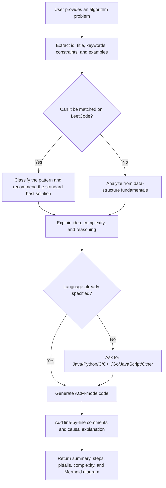

<p align="right">
  <a href="./README.md">中文</a> | <strong>English</strong>
</p>

<h1 align="center">ACM Master</h1>

<p align="center">
  <strong>An ACM/ICPC-style algorithm problem solving skill</strong>
</p>

<p align="center">
  <a href="#overview">Overview</a> ·
  <a href="#quick-start">Quick Start</a> ·
  <a href="#core-capabilities">Core Capabilities</a> ·
  <a href="#workflow">Workflow</a> ·
  <a href="#output-format">Output Format</a> ·
  <a href="#publishing-on-github">GitHub Publishing</a>
</p>

## Overview

`acm-master` is a Skill for algorithm practice and competitive-programming style problem solving. It identifies a user's problem statement, title, problem id, LeetCode link, or keywords, then tries to match the problem on LeetCode first. If no reliable match is found, it analyzes the problem from data-structure and algorithm fundamentals and recommends a low-complexity ACM-friendly solution.

The Skill is designed to produce a complete learning loop: problem classification, solution recommendation, complexity analysis, language selection, ACM-mode code, line-by-line comments, cause-and-effect explanations, pitfalls, and a Mermaid solution diagram.

## Use Cases

- A user provides an algorithm problem and wants ACM-mode code.
- A user provides only a LeetCode id, title, link, or keyword.
- A user wants to identify the underlying data structure or algorithm pattern.
- A user needs Java, Python, C, C++, Go, JavaScript, or another language.
- A user wants line-by-line comments, "because... therefore..." explanations, pitfalls, and a Mermaid diagram.
- A user wants Codex, Claude, or similar agents to follow one consistent algorithm-solving workflow.

## Quick Start

The repository provides two platform-ready folders:

```text
.codex/skills/acm-master/    # Ready for Codex
.claude/skills/acm-master/   # Ready for Claude Code
```

### Codex

Copy `.codex/skills/acm-master` into your Codex personal skills directory:

```text
~/.codex/skills/acm-master
```

Or keep the repository's project-level directory as-is:

```text
<your-project>/.codex/skills/acm-master
```

Then invoke it in Codex:

```text
Use $acm-master to solve this algorithm problem in ACM input/output style.
```

### Claude Code

Copy `.claude/skills/acm-master` into your Claude Code personal skills directory:

```text
~/.claude/skills/acm-master
```

Or keep the repository's project-level directory as-is:

```text
<your-project>/.claude/skills/acm-master
```

Then invoke it in Claude Code:

```text
/acm-master LeetCode 1 Two Sum in ACM mode. Explain the idea first.
```

## Core Capabilities

| Capability | Description |
|------------|-------------|
| Problem recognition | Extracts statement content, title, id, URL, keywords, examples, and constraints |
| LeetCode matching | Prioritizes URL, id, title, slug, examples, and constraints when matching LeetCode problems |
| Pattern classification | Labels arrays, hash maps, two pointers, sliding window, prefix sums, stacks, queues, trees, graphs, DP, greedy, and more |
| Solution recommendation | Chooses a balanced solution that is low-complexity and easy to learn |
| ACM code | Generates standard input/output code instead of LeetCode-only function signatures |
| Line-by-line explanation | Adds code comments and explains the code line by line |
| Causal reasoning | Explains key logic and edge cases using "because... therefore..." reasoning |
| Study summary | Produces a problem summary, steps, pitfalls, complexity analysis, and Mermaid diagram |

## Workflow



## Output Format

During the first analysis pass, the Skill provides problem recognition and a recommended solution. If the user has not specified a language, it asks for one:

```markdown
**题目识别**
- 匹配结果：
- 题型判断：

**推荐解法**
- 核心思路：
- 为什么这样做：
- 时间复杂度：
- 空间复杂度：

你想要哪种语言的 ACM 模式代码？Java / Python / C / C++ / Go / JavaScript / 其他？
```

After the user chooses a language, the Skill continues with:

```markdown
**ACM 代码**

**逐行说明**

**因为...所以...**

**用到的数据结构基础**

**题目总结**

**解题步骤**

**易错点**

**复杂度分析**

**Mermaid 思路图**
```

## ACM Code Requirements

- Code must read from standard input and write to standard output.
- Java code must use `Main` as the class name.
- Java should use `BufferedInputStream` or `BufferedReader` with `StringTokenizer` when appropriate.
- Python should use `sys.stdin.buffer.read()` or `sys.stdin.readline()` for large input.
- C/C++ should use standard headers and suitable fast I/O.
- Go should use buffered input/output.
- JavaScript should use `fs.readFileSync(0, "utf8")`.
- Generated code should not print interactive prompts.
- If the input format is unclear, the Skill should state its assumed input format before providing code.

## Agent Compatibility

This Skill is written in plain Markdown and can be used by Codex, Claude, and other agents that can read Skill instructions.

```text
.codex/skills/acm-master/
├── SKILL.md
└── agents/
    └── openai.yaml

.claude/skills/acm-master/
└── SKILL.md
```

Both platform folders use `SKILL.md` as the main entry point. The Codex version additionally includes `agents/openai.yaml` for Codex/OpenAI UI metadata such as display name, short description, and default prompt.

In a Skill-aware environment, invoke it with:

```text
Use $acm-master to solve this algorithm problem in ACM input/output style.
```

Agents with web access should verify LeetCode matches online. Agents without web access should clearly label matches as memory-based or inferred, then continue with standalone algorithm analysis.

## Project Structure

```text
acm-master/
├── README.md             # Chinese README, displayed by default on GitHub
├── README.en.md          # English README
├── SKILL.md              # Source Skill instructions used to build both platform folders
├── .codex/
│   └── skills/
│       └── acm-master/
│           ├── SKILL.md
│           └── agents/
│               └── openai.yaml
├── .claude/
│   └── skills/
│       └── acm-master/
│           └── SKILL.md
└── agents/
    └── openai.yaml       # Source Codex/OpenAI UI metadata
```

## Examples

```text
Use $acm-master to solve LeetCode 1 Two Sum in ACM mode. Explain the idea first.
```

```text
Use $acm-master to analyze this problem: Given n numbers and a target k, determine whether two numbers sum to k.
```

```text
Use $acm-master to generate C++ ACM code and explain which data-structure fundamentals are used.
```

## Publishing On GitHub

- Keep `README.md` as the default Chinese entry point.
- Keep the English documentation in `README.en.md` and link it from the header language switch.
- Publish `.codex/skills/acm-master` as the folder Codex users can use or copy directly.
- Publish `.claude/skills/acm-master` as the folder Claude Code users can use or copy directly.
- Add a `LICENSE` file before public distribution if you want explicit usage and redistribution terms.
- Before publishing, re-check that `SKILL.md` and `agents/openai.yaml` use consistent names, descriptions, and default prompts.

## Maintenance Notes

- Update `SKILL.md` first when changing the solving workflow.
- After changing the source `SKILL.md`, copy it to `.codex/skills/acm-master/SKILL.md` and `.claude/skills/acm-master/SKILL.md`.
- Update `agents/openai.yaml` when the display name, short description, or default prompt changes.
- After changing `agents/openai.yaml`, copy it to `.codex/skills/acm-master/agents/openai.yaml`.
- This Skill currently has no scripts, templates, or extra resource files.

## License

This Skill directory does not currently include a standalone `LICENSE` file. Add an explicit license before public distribution or open-source release.
