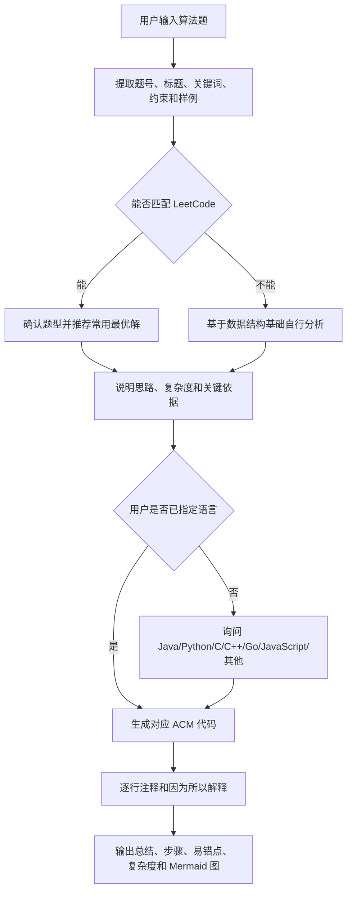

<p align="right">
  <strong>中文</strong> | <a href="./README.en.md">English</a>
</p>

<h1 align="center">ACM Master</h1>

<p align="center">
  <strong>面向 ACM/ICPC 输入输出模式的算法题解 Skill</strong>
</p>

<p align="center">
  <a href="#概览">概览</a> ·
  <a href="#快速使用">快速使用</a> ·
  <a href="#核心能力">核心能力</a> ·
  <a href="#工作流">工作流</a> ·
  <a href="#输出规范">输出规范</a> ·
  <a href="#github-发布建议">GitHub 发布</a>
</p>

## 概览

`acm-master` 是一个面向算法题和竞赛刷题场景的 Skill。它会识别用户输入的题目内容、标题、题号、LeetCode 链接或关键词，优先尝试匹配 LeetCode；如果无法匹配，则基于数据结构与算法基础自行分析题型，并给出低时间复杂度、适合 ACM 模式的解法。

这个 Skill 的重点不是只给答案，而是按学习和竞赛训练的节奏完成完整闭环：题型判断、解法推荐、复杂度分析、语言选择、ACM 代码、逐行注释、因果解释、易错点总结和 Mermaid 思路图。

## 适用场景

- 用户提供一道算法题，希望得到 ACM 模式代码。
- 用户只给出 LeetCode 题号、标题、链接或关键词。
- 用户希望判断题目属于哪类数据结构或算法模型。
- 用户需要 Java、Python、C、C++、Go、JavaScript 或其他语言版本代码。
- 用户希望看到逐行注释、“因为……所以……”式讲解、易错点和 Mermaid 图示。
- 用户希望 Codex、Claude 等 agent 以统一流程解决算法题。

## 快速使用

仓库提供两套可直接复制使用的平台目录：

```text
.codex/skills/acm-master/    # Codex 可用版本
.claude/skills/acm-master/   # Claude Code 可用版本
```

### Codex

将 `.codex/skills/acm-master` 复制到 Codex 的个人 skills 目录：

```text
~/.codex/skills/acm-master
```

或者直接保留仓库中的项目级目录：

```text
<your-project>/.codex/skills/acm-master
```

然后在 Codex 中使用：

```text
Use $acm-master to solve this algorithm problem in ACM input/output style.
```

### Claude Code

将 `.claude/skills/acm-master` 复制到 Claude Code 的个人 skills 目录：

```text
~/.claude/skills/acm-master
```

或者直接保留仓库中的项目级目录：

```text
<your-project>/.claude/skills/acm-master
```

然后在 Claude Code 中直接调用：

```text
/acm-master LeetCode 1 Two Sum，要求 ACM 模式，先讲思路
```

## 核心能力

| 能力 | 说明 |
|------|------|
| 题目识别 | 提取题目内容、标题、题号、URL、关键词、样例与约束 |
| LeetCode 匹配 | 按 URL、题号、标题、slug、样例和约束优先匹配 LeetCode |
| 题型判断 | 标注数组、哈希表、双指针、滑动窗口、前缀和、栈、队列、树、图、DP、贪心等类型 |
| 解法推荐 | 选择综合最优、低复杂度且容易掌握的解法 |
| ACM 代码 | 生成标准输入输出代码，不使用 LeetCode-only 函数签名 |
| 逐行讲解 | 代码内提供注释，并在代码后逐行说明 |
| 因果解释 | 用“因为……所以……”解释关键逻辑和边界条件 |
| 总结沉淀 | 输出题目总结、解题步骤、易错点、复杂度分析和 Mermaid 思路图 |

## 工作流



## 输出规范

首次分析题目时，Skill 会先给出题目识别和推荐解法，并在没有指定语言时询问用户：

```markdown
**题目识别**
- 匹配结果：
- 题型判断：

**推荐解法**
- 核心思路：
- 为什么这样做：
- 时间复杂度：
- 空间复杂度：

你想要哪种语言的 ACM 模式代码？Java / Python / C / C++ / Go / JavaScript / 其他？
```

用户选择语言后，Skill 会继续输出：

```markdown
**ACM 代码**

**逐行说明**

**因为...所以...**

**用到的数据结构基础**

**题目总结**

**解题步骤**

**易错点**

**复杂度分析**

**Mermaid 思路图**
```

## ACM 代码要求

- 必须从标准输入读取，并向标准输出写入。
- Java 代码使用 `Main` 作为类名。
- Java 推荐使用 `BufferedInputStream` 或 `BufferedReader` 搭配 `StringTokenizer`。
- Python 推荐使用 `sys.stdin.buffer.read()` 或 `sys.stdin.readline()` 处理大输入。
- C/C++ 使用标准头文件和适当的快速输入输出。
- Go 使用缓冲输入输出。
- JavaScript 使用 `fs.readFileSync(0, "utf8")`。
- 不在生成代码中加入交互式提示语。
- 如果输入格式不明确，先说明假设的输入格式，再给出代码。

## Agent 适配

该 Skill 使用纯 Markdown 编写，可供 Codex、Claude 和其他能读取 Skill 指令的 agent 使用。

```text
.codex/skills/acm-master/
├── SKILL.md
└── agents/
    └── openai.yaml

.claude/skills/acm-master/
└── SKILL.md
```

两套目录都以 `SKILL.md` 作为核心入口。Codex 版本额外包含 `agents/openai.yaml`，用于提供 Codex/OpenAI UI 可读取的展示名称、简短描述和默认调用提示。

在支持 Skill 的环境中，可以这样触发：

```text
Use $acm-master to solve this algorithm problem in ACM input/output style.
```

具备联网能力的 agent 应优先在线核验 LeetCode 匹配结果；没有联网能力的 agent 应明确说明匹配来自记忆或推断，并继续给出独立算法分析。

## 目录结构

```text
acm-master/
├── README.md             # 中文说明文档，GitHub 默认展示
├── README.en.md          # 英文说明文档
├── LICENSE               # MIT License
├── SKILL.md              # 源 Skill 说明，作为两套平台包的内容来源
├── .codex/
│   └── skills/
│       └── acm-master/
│           ├── SKILL.md
│           └── agents/
│               └── openai.yaml
├── .claude/
│   └── skills/
│       └── acm-master/
│           └── SKILL.md
└── agents/
    └── openai.yaml       # 源 Codex/OpenAI UI 元数据
```

## 使用示例

```text
使用 $acm-master 解决：LeetCode 1 两数之和，要求 ACM 模式，先讲思路。
```

```text
使用 $acm-master 分析这道题：给定 n 个数和目标值 k，求是否存在两个数之和等于 k。
```

```text
使用 $acm-master 给我 C++ 版本 ACM 代码，并解释用到了哪些数据结构基础。
```

## GitHub 发布建议

- 将 `README.md` 保留为中文默认入口。
- 将英文文档保留为 `README.en.md`，并通过页眉语言切换链接访问。
- 将 `.codex/skills/acm-master` 作为 Codex 用户可直接使用或复制的目录。
- 将 `.claude/skills/acm-master` 作为 Claude Code 用户可直接使用或复制的目录。
- 项目已使用 MIT License 开源，`LICENSE` 文件位于仓库根目录。
- 发布前可再次检查 `SKILL.md` 和 `agents/openai.yaml` 中的名称、描述和默认提示是否一致。

## 维护说明

- 更新解题流程时，优先修改 `SKILL.md`。
- 修改源 `SKILL.md` 后，同步复制到 `.codex/skills/acm-master/SKILL.md` 和 `.claude/skills/acm-master/SKILL.md`。
- 如果展示名称、默认提示或 UI 描述发生变化，同步更新 `agents/openai.yaml`。
- 如果 `agents/openai.yaml` 发生变化，同步复制到 `.codex/skills/acm-master/agents/openai.yaml`。
- 该 Skill 当前不包含脚本、模板或额外资源文件。

## License

本项目使用 MIT License 开源。完整许可证文本见 [LICENSE](./LICENSE)。
